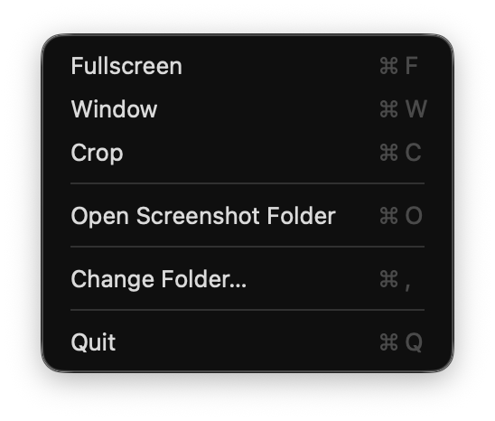

## 📸 ScreenShot — App for macOS Tahoe 26

**ScreenShot** is a lightweight macOS **menu bar app** for **Tahoe 26**, letting you take instant screenshots directly from your menu bar .

---

## 🚀 Features

- 📸 Fullscreen, window, and cropped screenshot options  
- 📋 Automatically copies screenshot to clipboard  
- 📁 Choose your screenshot folder on first launch  
- 🧼 Simple interface — no unnecessary menus or complexity  

---

## ✅ Compatibility

- macOS **Tahoe 26** (Apple Silicon)

---

## 📦 Installation

1. Download [`ScreenShot.dmg`](https://github.com/ExTV/screenshot-menu-bar-app/raw/main/ScreenShot.dmg)
2. Open it and **drag `ScreenShot.app` into the Applications folder**  
3. Launch the app from Launchpad or Spotlight  
4. First launch will prompt you to select a screenshot folder  
5. Done! You’ll now see a camera icon in your menu bar

---


## ✨ Screenshot



---

## 🛠️ Build from Source

1. Clone the repository:
   ```sh
   git clone https://github.com/ExTV/screenshot-menu-bar-app.git
   ```
2. Open `ScreenShot.xcodeproj` in Xcode.
3. Select the `ScreenShot` scheme and your target device.
4. Build and run.

---

## 💡 Usage

- Click the camera icon in the menu bar to access screenshot options.
- Use keyboard shortcuts for quick actions (customizable in System Preferences).
- Screenshots are saved to your chosen folder and copied to the clipboard.

---

## 🛠️ Contributing

Contributions are welcome! To contribute:
- Fork the repository and create your branch.
- Make your changes with clear commit messages.
- Open a pull request describing your changes.

---

## 🐞 Troubleshooting

- If the app does not appear in the menu bar, ensure you are running macOS Tahoe 26 or later.
- If you encounter permission issues accessing your chosen screenshot folder, ensure the app has access to that folder in System Preferences.
- Restart the app after changing permissions.

---

## 📄 License

MIT — see [LICENSE](LICENSE) for details.
