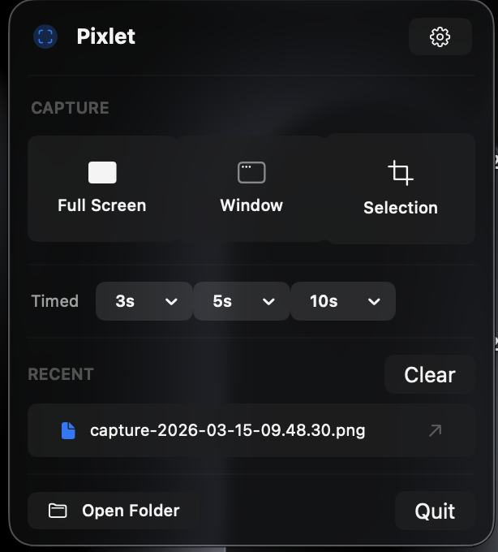

# Pixlet — Screen Capture for macOS 26

[](https://github.com/ExTV/screenshot-menu-bar-app/releases/latest)

**Pixlet** is a sleek, modern macOS **menu bar app** built for **macOS 26 (Tahoe)** with full **Liquid Glass** design. Capture your screen instantly without interrupting your workflow.

---

## Preview



---

## Features

- **Liquid Glass UI** — built from the ground up for macOS 26 with native glass effects
- **Full Screen, Window & Selection** capture modes
- **Timed captures** — 3s, 5s, 10s delay with mode selection
- **Auto copies to clipboard** — paste anywhere instantly (PNG + TIFF + file URL)
- **Recent captures** — quick access to your last 5 captures from the menu
- **Notifications** — thumbnail preview of your capture shown in the notification
- **Onboarding flow** — guided permission setup on first launch (Screen Recording, Notifications, Folder)
- **Preferences** — format (PNG, JPEG, HEIC, TIFF), auto-open, notifications, folder
- **Launch at login** via `SMAppService`
- **Sandboxed & Hardened Runtime** — secure by design

---

## Compatibility

- macOS **26 (Tahoe)** or later
- Apple Silicon & Intel

---

## Installation

1. Download **[Pixlet.dmg](https://github.com/ExTV/screenshot-menu-bar-app/releases/latest)** from the latest release
2. Open it and drag **Pixlet.app** into Applications
3. Launch from Launchpad or Spotlight
4. On first launch, grant **Screen Recording** permission and choose a save folder
5. Pixlet appears in your menu bar — ready to capture

---

## Build from Source

```sh
git clone https://github.com/ExTV/screenshot-menu-bar-app.git
cd screenshot-menu-bar-app
open pixlet.xcodeproj
```

Select the **Pixlet** scheme, build and run (requires Xcode 26+, macOS 26 SDK).

---

## Permissions

| Permission | Purpose |
|---|---|
| Screen Recording | Required to capture your screen |
| Notifications | Optional — shows capture thumbnail after saving |
| User-Selected Files | Read/write access to your chosen save folder |

---

## Troubleshooting

- **App not capturing** — go to System Settings → Privacy & Security → Screen Recording and enable Pixlet, then relaunch
- **Folder not accessible** — re-select it via Settings → Capture Folder → Change…
- **Icon not showing** — make sure you are on macOS 26 or later

---

## Contributing

Pull requests are welcome.
- Fork the repo and create a feature branch
- Make changes with clear commit messages
- Open a PR describing what changed and why

---

## License

MIT — see [LICENSE](LICENSE) for details.
